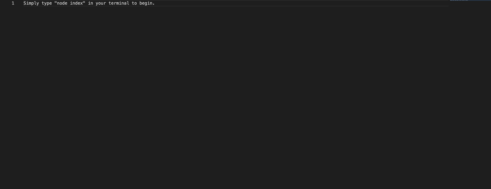

# README-Maker

## Description
Welcome to my README generator! Struggling to decide what to write in your README for your GitHub repo? Well look no further because I have a solution for you.
My program will walk you through all the key points to include in a README and ask for your input, and then generate a clean README for you to use.

## Key Features
*Step by step process to cover everything needed in a quality README.
*Clean efficient design
*Includes badge based on your license choice.
*Includes a Table of Contents for the headers.

## Installation and Usage
Simply clone the repo to install. Then cd to the folder and open in your (integrated) terminal, type "node index", hit enter, and fill out the prompts.

## Screenshot:

